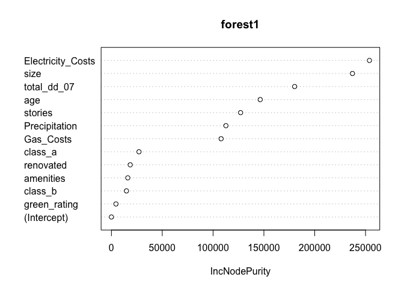

Exercise 3
================
Alex Rados, Akhil Jonnalagadda, and Kenny Kato

# Predictive Model Building

## Overview

The goal at hand is producing the best model to predict rental income
per square foot of commercial rent buildings across the United States.
The main variable we are interested in is their green rating, whether
the building has been awarded LEED or EnergyStar certification (or both)
as a green building, and how that affects the rental price. We will thus
build a predictive model for price using the variables provided and
evaluate the effect of having a green rating or not.

## Data

We will be looking at the green buildings dataset to assess how the rent
price (in dollars per square foot per calendar year) of commercial rent
buildings across the United States is effected by a variety of variables
including size (total square footage of available renting space), number
of floors, and their green rating, to list a few.

Using these variables, we will fit a random forest model, attempting to
get the most accurate prediction of rent prices based on the variables
provided. The accuracy of the model will be measured in the form of the
root mean-squared error (RMSE). Once we fit said model, we will use it
to quantify the average change in rental income per square foot
associated with green certification, holding other features of the
building constant.

In order to generate the most accurate predictions, however, we can’t
judge it based on past data that we have. Thus, we randomly sampled 80%
of the data at hand and used that as a training set on which we built
our model while using the other 20% as a test set on which we tested our
model to gather a sufficient RMSE. This then allows us to measure the
out-of-sample performance.

## Model

I decided on using a random forest model as it would give accurate and
legitimate results while not needing the specifics that boosting
requires. I initially began by setting a random forest model to
variables that I assumed would have a significant effect on rent price.

I then began to whittle down the components of the model, getting rid of
or adjusting the variables that had the smallest effects on the SSE when
being included depending on the variable imporance plot.
<!-- -->

I finally ended up settling on the following model that resulted in the
lowest RMSE when attempting to predict the out-of-sample rent prices.
This was after ensuring that the random variation that comes with a
train/test split along with the model itself is taken care of and is
guaranteeing that we are choosing the model that is consistently the
best
predictor.

\[y = Agex_{1} + Class_ax_{2} + Class_bx_{3} + Green Ratingx_{4} + Amenitiesx_{5} + Sizex_{6} + Storiesx_{7} + Renovatedx_{8} + Precipitationx_{9} + Gas Costsx_{10} + Electricity Costsx_{11} + Total Degree Daysx_{12}\]

    ## [1] 7.433272

From this model, the average change in absolute terms in rental income
per square foot associated with whether one has a green certification or
not is as follows:

    ##   green_rating     yhat
    ## 1            0 28.43318
    ## 2            1 28.78113

## Conclusion

Through using a random forest model, we found an accurate way of
predicting rental income per square foot with a variety of variables.
While many made significant impacts on the dependent variable at hand,
the most important ones were electricity costs in the building’s
geographic region and size of the rental space. The least important
components were indeed whether the building was green certified by
either LEED or EnergyStar and the amenities that were included.

Thus, if a leasing company is looking to make the most out of the
factors that go into constructing and leasing a building, we would
recommend focusing on choosing the right region surrounding the project
and the size of the available space for rent.

# What Causes What?

1.  Why can’t I just get data from a few different cities and run the
    regression of “Crime” on “Police” to understand how more cops in the
    streets affect crime? (“Crime” refers to some measure of crime rate
    and “Police” measures the number of cops in a city.)

There is legitimacy to either argument that higher crime rates force a
leader to increase the size of the police force (high crime rates for
large police force) or a larger police force leads to lower crime rates
(low crime rates for large police force), giving opposing results to how
the amount of police affects crime rates.

We also are not necessarily asking a causal question here but rather a
correlation question, so a regression of crime on police wouldn’t answer
“does increasing the amount of cops lead to lower crime” because crime
rates affect the amount of police deployed (given one lives in a
reasonable neighborhood) yet the amount of police would also affect
crime rates. Because police is an endogenous variable, we would have to
bring in an instrumental variable that is exogenous and is related to
the size of the police force while not directly related to street level
crime rates. Enter, terrorism alert level.

2.  How were the researchers from UPenn able to isolate this effect?
    Briefly describe their approach and discuss their result in the
    “Table 2”, from the researchers’ paper.

You can’t effectively estimate street crime rates just by looking at
level of police force because of what we described earliers. Thus,
researchers wanted to find an example where there’s a lot of police for
reasons unrelated to crime, which ended up being the terrorism alert
system. This represents an instrumental variable, a variable that is
related to amount of police used but is not related at all with street
crime.

When the terror alert level goes to orange, extra police are used in
Washington D.C. to protect against possible terror attacks. This
shouldn’t be related at all to street crime, so then they could
evaluate those days when there’s extra police to see what happens to
street crime and not worry about street crime having an effect on the
amount of police deployed. Street crime does indeed go down in this case
and is significant at the 5% level, allowing us to reject the null that
the number of police doesn’t affect the crime rate.

3.  Why did they have to control for Metro ridership? What was that
    trying to capture?

They questioned whether it was possible that tourists were less likely
to be out when there is a terror alert level that is orange, which would
remove one of the two requirements for an instrumental variable that it
isn’t correlated with the outcome, crime rate. To combat this, they
controlled for metro ridership, thus including the possibility that the
street crime rate didn’t drop just because there were less people
outside (or, in the case of the original question proposed on the
podcast, that the criminals weren’t staying at home because of the
threat of terrorsim).

4.  Below I am showing you “Table 4” from the researchers’ paper. Just
    focus on the first column of the table. Can you describe the model
    being estimated here? What is the conclusion?

The model being estimated is a regression of crime rates in Washington
D.C. on high alert (whether there was a terror alert level of orange
which provides an unusual increase in the amount of police present)
interacted with the first district of Washington D.C. and high alert
interacted with all the other districts while still controlling for
Metro ridership.

We are seeing that there is a difference in the high alert police level
effects on crime rates between District 1 and every other district. When
there is an unusual influx of police to District 1 because of a high
terror level, it decreases crime rates more drastically than when there
is an increase in police in every other district (for District 1 it
would be a significant decrease at the 1% level while for the other
districts it wouldn’t be significant at all). This provides some
evidence that maybe an increase in police in District 1 provides a
decrease in street crime while for every other district we can’t reject
the null that the crime rate does not change with a change in amount of
police.
